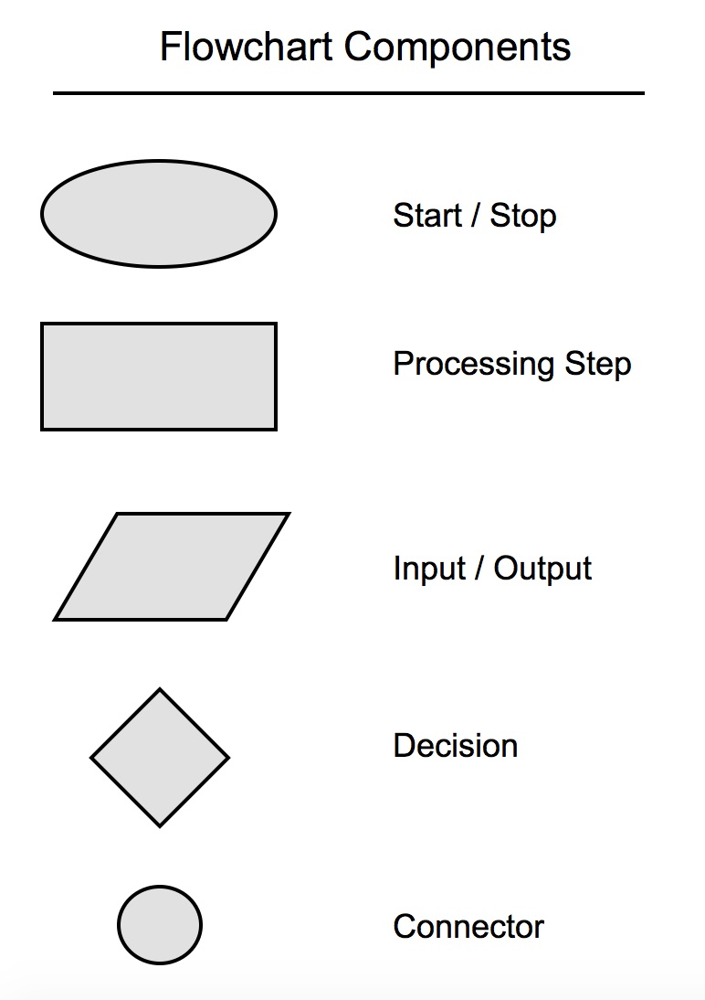
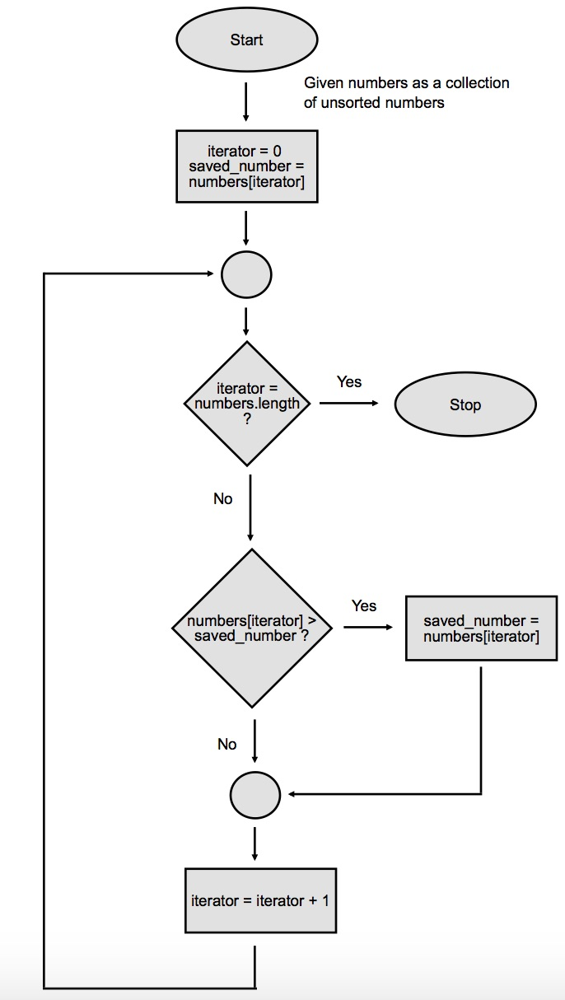

# Flowchart

`Flowchart's` are very helpful when trying to create a logical sequence. A flowchart creates a map on how logic will react at certain points

Here's an example:

Working with `flowcharts` helps like how [[Pseudocode]] does, it takes a level of abstraction away from the problem solving. You are creating logic separate from the programming language.

---

Created on: 2024-12-05 08:17
Tags: #fleeting #thinking #thoughts
References:
